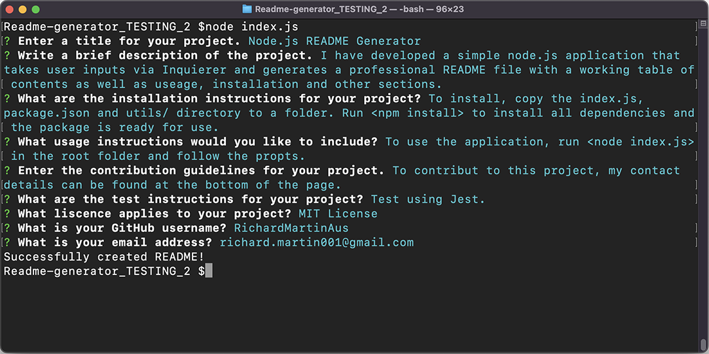
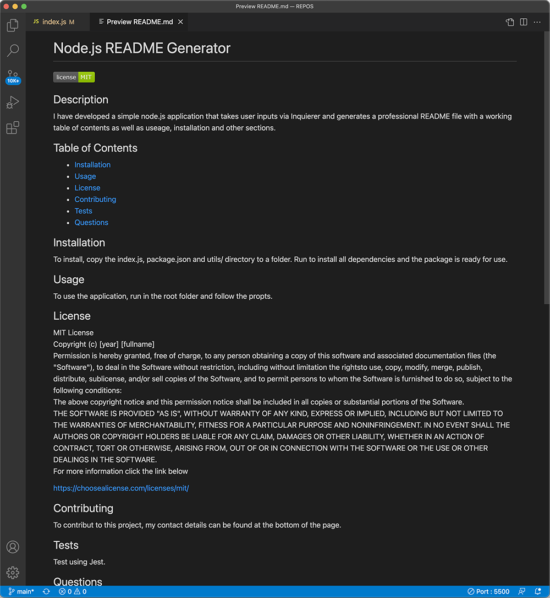

# Node.js README Generator

## Description

I have developed a simple node.js application that takes user inputs via Inquierer and generates a professional README file with a working table of contents as well as useage, installation and other sections.

## Table of Contents

- [Installation](#installation)
- [Usage](#usage)
- [Contributing](#contributing)
- [Questions](#questions)

## Installation

To install, copy the index.js, package.json and utils/ directory to a folder. Run 'npm install' to install all dependencies and the package is ready for use.

## Usage

To use the application, run 'node index.js' in the root folder and follow the propts. A README file will be written to the root directory.

See screenshot below to see the applicaiton running in terminal:

See screenshot of a sample README document below:

Video demo of the app:
https://drive.google.com/file/d/16_Q9SvD0rptwkA10p2qM1J4Ys8u0HAUE/view

## Contributing

To contribut to this project, my contact details can be found at the bottom of the page.

## Questions

My github username is RichardMartinAus and my profile can be found at [https://github.com/RichardMartinAus], or email me at richard.martin001@gmail.com for any further questions of collaboration requests.
